# Introduction

Simulate the game Geometry Dash with vanilla JavaScript and HTML/CSS

##### Supported Features:

Player Form:

- Cube
- Ship
- UFO

Ring: 
- Yellow Ring
- Blue Ring

Portal:
- Cube Portal
- Ship Portal
- UFO Portal
- Gravity Portal
- 
Obstacle:
- Spike
- Gear
- Platform
- Wall

## How to Play

--------------------

The only thing you need to do is 'click' (Only the 'click' happens in the game screen can be detected):

##### First: 

The basic behavior caused by 'click' is decided by your 'Player Form'. The table below shows you the detail of this:

| Player Form | Display           | Click Behavior                                               |
| ----------- | ----------------- | ------------------------------------------------------------ |
| Cube        | 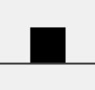 | When you on the ground and a 'click' happened ('hold click' as well), the Cube will jump. |
| Ship        | 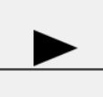 | When you hold 'click', the Ship will be able to fly upward. Otherwise, it will be affected by gravity and drop down. |
| UFO         | 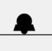  | Each time you click, the UFO will jump even though it is in air. (Yeah, just like Flappy Bird) |

##### Second:

Ring, a kind of object displayed as a circle with different color, will grant you extra behavior if you click <u>**when**</u> the player's sprite moves onto the Ring. The table below shows you the detail of this:

| Ring Type   | Display                  | Activation behavior                         |
| ----------- | ------------------------ | ------------------------------------------- |
| Yellow Ring | 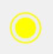 | Grant the player an extra jump immediately. |
| Blue Ring   | 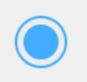   | Reverse the player's gravity.               |

When you activate a Ring, there will be wave effect on the Ring like this: 

##### Third:

Player's behavior will be change passively if it <u>**enters**</u> a Portal which displayed as a long rectangle. The table below shows you the detail of this:

| Portal Type             | display                       | behavior when entered                           |
| ----------------------- | ----------------------------- | ----------------------------------------------- |
| Cube Portal             | 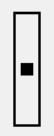      | Transform the player's form to Cube.            |
| Ship Portal             | 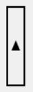      | Transform the player's form to Ship.            |
| UFO Portal              | 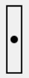       | Transform the player's form to UFO.             |
| Positive Gravity Portal | 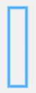 | Make the gravity point down. (positive gravity) |
| Reversed Gravity Portal | 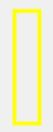 | Make the gravity point up. (reversed gravity)   |

##### Finally

There are some extra objects in this trivial demo. The table below shows you the detail of this:

| Object   | Display               | Function                                                     |
| -------- | --------------------- | ------------------------------------------------------------ |
| Spike    | 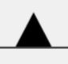    | When you collide with them, you die.                         |
| Gear     |      | When you collide with them, you die.                         |
| Wall     |      | When you collide with them, you die.                         |
| Platform | 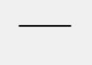 | They allow you to stand on them, but if you contact with platform from the other side, you die. |
| End line | 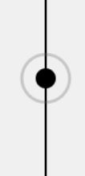  | The destination of the game. If you reach this line, you complete the level. |

## Other Issues

--------------------

- When you died, the game will automatically restart after 1 second.
- The game is paused when the page is loaded. You can click in the game screen or press 'esc' to start the game. Of course, you are able to pause the game by pressing 'esc'.
- You may feel hard if this is the first time you play a game like this. The features in the origin game are very complex, and Geometry Dash prepares a level for each feature to make players familiar with them. But there is only 1 level which combines all the features that is included in this project. This project can't reach GD's level design and I'm very sorry. But I still hope you can have fun.